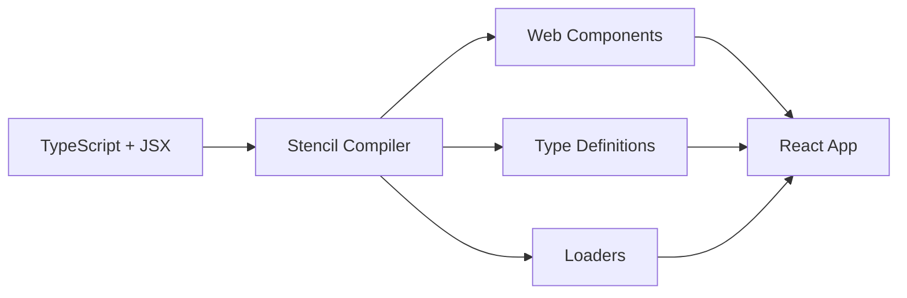

# UI-WoT Architecture Documentation

## 📁 Project Structure Overview

```
ui-wot/                           # Root monorepo
├── package.json                  # Workspace configuration
├── README.md                     # Main documentation
├── LICENSE.md                    # EPL-2.0 OR W3C-20150513 license
├── SECURITY.md                   # Security guidelines
├── CODE_OF_CONDUCT.md           # Community guidelines
├── NOTICE.md                    # Copyright notices
└── packages/                    # Main packages directory
    ├── components/              # Stencil-based UI components library
    │   ├── package.json         # Component library config
    │   ├── stencil.config.ts    # Stencil build configuration
    │   ├── tsconfig.json        # TypeScript configuration
    │   ├── LICENSE              # MIT License for components
    │   ├── README.md            # Component library docs
    │   ├── loader/              # Generated component loaders
    │   │   ├── index.js         # ESM loader
    │   │   ├── index.cjs.js     # CommonJS loader
    │   │   └── index.d.ts       # TypeScript definitions
    │   ├── src/                 # Source code
    │   │   ├── components/      # Individual components
    │   │   │   ├── ui-heading/  # Custom heading component
    │   │   │   │   ├── ui-heading.tsx     # Component implementation
    │   │   │   │   ├── ui-heading.css     # Component styles
    │   │   │   │   └── readme.md          # Component documentation
    │   │   │   └── my-component/          # Example component
    │   │   │       ├── my-component.tsx   # Component implementation
    │   │   │       ├── my-component.css   # Component styles
    │   │   │       ├── my-component.spec.ts  # Unit tests
    │   │   │       ├── my-component.e2e.ts   # E2E tests
    │   │   │       └── readme.md          # Component documentation
    │   │   ├── lib/             # Utility functions
    │   │   │   └── renderHeading.ts       # Helper functions
    │   │   ├── utils/           # Shared utilities
    │   │   │   ├── utils.ts     # Common utilities
    │   │   │   └── utils.spec.ts # Utility tests
    │   │   ├── components.d.ts  # Generated type definitions
    │   │   ├── index.ts         # Library entry point
    │   │   └── index.html       # Development preview
    │   └── www/                 # Built assets (generated)
    │       ├── build/           # Compiled components
    │       └── index.html       # Demo page
    └── generator/               # React-based showcase app
        ├── package.json         # Generator app config
        ├── vite.config.ts       # Vite build configuration
        ├── tsconfig.json        # TypeScript configuration
        ├── index.html           # App entry point
        └── src/                 # Source code
            ├── App.tsx          # Main React component
            ├── App.css          # App styles
            ├── main.tsx         # React entry point
            ├── index.css        # Global styles
            └── custom-elements.d.ts # Custom element types
```

## 🎯 Technology Stack Details

### **Core Technologies**

#### **1. StencilJS Framework (Components Package)**

- **Purpose**: Compile-time framework for building Web Components
- **Version**: ^4.27.1
- **Benefits**:
  - Framework-agnostic output
  - TypeScript + JSX support
  - Multiple build targets
  - Lazy loading capabilities
  - Shadow DOM support

#### **2. React + Vite (Generator Package)**

- **React**: ^18.3.1 - Modern React with hooks
- **Vite**: ^6.0.1 - Fast build tool and dev server
- **Benefits**:
  - Fast hot module replacement
  - Modern ESM-based bundling
  - TypeScript support out of the box

#### **3. TypeScript**

- **Version**: ~5.6.2
- **Purpose**: Type safety across all packages
- **Configuration**: Strict mode enabled

### **Build & Development Tools**

#### **Testing Stack**

- **Jest**: ^29.7.0 - Unit testing framework
- **Puppeteer**: ^24.3.0 - E2E testing browser automation
- **Stencil Testing**: Built-in testing utilities

#### **Code Quality**

- **ESLint**: ^9.15.0 - Code linting
- **Prettier**: Code formatting (configured)
- **TypeScript**: Static type checking

### **Package Management**

- **Workspaces**: Yarn/npm workspaces for monorepo management
- **Local Dependencies**: Cross-package references using `file:` protocol

## 🔧 Architecture Patterns

### **Component Architecture**

#### **Stencil Component Structure**

```typescript
@Component({
  tag: "ui-heading", // Custom element tag name
  styleUrl: "ui-heading.css", // Component-scoped styles
  shadow: true, // Shadow DOM encapsulation
})
export class UiHeading {
  @Prop() text: string; // Component properties

  render() {
    // JSX render method
    return <h1>{this.text}</h1>;
  }
}
```

#### **Distribution Strategy**

1. **dist**: Standard distribution with lazy loading
2. **dist-custom-elements**: Standalone custom elements
3. **docs-readme**: Auto-generated documentation
4. **www**: Development server output

### **Integration Patterns**

#### **React Integration**

```typescript
// Method 1: Using helper functions
import { renderHeading } from "ui-wot-components";
import { defineCustomElements } from "ui-wot-components/loader";

// Method 2: Direct custom element usage
import "ui-wot-components/dist/components/ui-heading";
```

#### **Framework Agnostic Usage**

```html
<!-- Can be used in any HTML -->
<script
  type="module"
  src="ui-wot-components/dist/ui-wot-components/ui-wot-components.esm.js"
></script>
<ui-heading text="Hello World"></ui-heading>
```

## 🎯 Data Flow

### **Development Workflow**

1. **Component Development** in `packages/components/src/components/`
2. **Stencil Build** generates multiple output formats
3. **React Consumer** in `packages/generator/` imports and uses components
4. **Testing** at both component and integration levels

### **Build Process**



## 🔒 Security & Licensing

### **Dual License**

- **EPL-2.0**: Eclipse Public License 2.0
- **W3C-20150513**: W3C Software Notice and Document License

### **Security**

- Eclipse Foundation Security Team oversight
- Vulnerability reporting via security@eclipse-foundation.org
- Regular security assessments

## 🚀 Performance Considerations

### **Lazy Loading**

- Components loaded on-demand
- Minimal initial bundle size
- Tree-shaking support

### **Build Optimization**

- Multiple output formats for different use cases
- Minification and compression
- TypeScript compilation for performance

## 🧪 Testing Strategy

### **Unit Testing**

- Component isolation testing
- Utility function testing
- Jest + Stencil testing utilities

### **End-to-End Testing**

- Puppeteer-based browser testing
- Component interaction testing
- Cross-browser compatibility

### **Integration Testing**

- React + Stencil integration
- Framework interoperability
- Build pipeline validation

## 📊 Project Metrics

### **Package Sizes**

- Components library: Optimized for tree-shaking
- Generator app: Development/demo purposes
- Minimal runtime overhead

### **Browser Support**

- Modern browsers with Custom Elements support
- Polyfill support for legacy browsers
- Shadow DOM compatibility

## 🔄 Development Lifecycle

### **Component Creation**

1. Generate component scaffold
2. Implement component logic
3. Add styles and tests
4. Document component API
5. Build and validate

### **Release Process**

1. Version bump
2. Build all packages
3. Run test suite
4. Generate documentation
5. Publish to npm

This architecture supports the Eclipse ThingWeb project's goal of creating standardized, reusable UI components for IoT applications following W3C Web of Things specifications.
