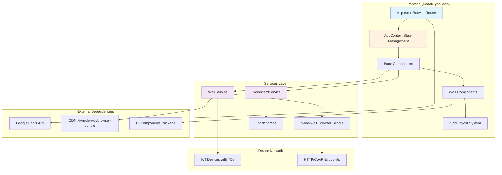
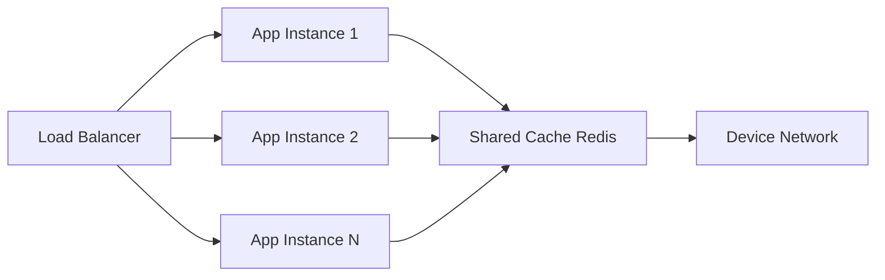

# UI-WoT Generator Technical Deliverable

## 1. Executive Summary

The UI-WoT Generator is a React-based dashboard application that enables dynamic creation of Web of Things (WoT) user interfaces from Thing Descriptions (TDs). The system allows users to consume TDs from URLs or files, select device affordances (properties, actions, events), and generate interactive dashboard components using a drag-and-drop grid layout. The application leverages the WoT standard for IoT device interoperability and provides real-time device interaction capabilities.

**Key Recommendations**: The current implementation requires significant architectural improvements including proper error handling, state persistence optimization, performance enhancements for large component sets, and security hardening for production deployment. Critical issues include memory leaks in component lifecycle management, lack of proper error boundaries, and insufficient validation of TD inputs.

## 2. Full Workflow

### End-to-End User Flow
```
User Journey: TD Input → Affordance Selection → Component Generation → Dashboard Interaction

1. Home Page (/)
   └── User clicks "+" button
   
2. TD Input Page (/td-input)
   ├── User uploads TD file OR inputs TD URL
   ├── WoT Service parses TD and extracts affordances
   └── Navigation to Affordance Selection

3. Affordance Selection (/affordances)
   ├── Display available properties/actions/events
   ├── User selects desired affordances
   ├── Map affordances to UI components (ui-button, ui-slider, etc.)
   └── Navigation to Component Canvas

4. Component Canvas (/components)
   ├── Generate WoT Thing instances
   ├── Create draggable component grid
   ├── Enable real-time device interaction
   ├── Support component editing/customization
   └── Dashboard save/load functionality
```

### Technical Data Flow
```
TD Consumption Flow:
File/URL → WoTService.parseTDFromSource() → TD Validation → 
Affordance Extraction → Component Mapping → Thing Creation → 
Grid Layout Generation → DOM Rendering → Event Binding

Real-time Interaction Flow:
User Action → Component Event → WoT Thing Method → 
Network Request → Device Response → UI State Update
```

## 3. System Architecture



### Component Interactions
- **AppContext**: Central state management using React useReducer
- **WoTService**: Handles TD parsing, Thing creation, and device communication
- **DashboardService**: Manages dashboard persistence and export/import
- **Grid Layout**: React-grid-layout for drag-and-drop component positioning

### QA/Test Boundaries
- **Unit Tests**: Individual service methods, utility functions
- **Integration Tests**: Component-to-service interactions, TD parsing
- **E2E Tests**: Complete user workflows, device communication

### Deployment Topology
- **Frontend**: Static SPA deployable to CDN (Vercel, Netlify, S3+CloudFront)
- **Assets**: Google Fonts, Node-WoT bundle via CDN
- **Storage**: Browser localStorage for dashboard persistence
- **Network**: Direct HTTP/HTTPS connections to IoT devices

## 4. Code Walkthrough

### Key Modules and Files

#### Core Application Structure

**`/src/App.tsx`** - Main application router and navigation sync
```typescript
// Key functions:
- RouterSync(): Synchronizes URL routes with AppContext state
- BrowserRouter configuration with future flags
```

**`/src/context/AppContext.tsx`** - Central state management
```typescript
// Key interfaces and functions:
interface AppState {
  currentView: 'home' | 'td-input' | 'affordance-selection' | 'component-canvas';
  tdInfos: TDInfo[];
  components: WoTComponent[];
  things: Map<string, any>;
}

function appReducer(state: AppState, action: AppAction): AppState
// Handles state transitions for all app operations
```

**`/src/services/wotService.ts`** - WoT protocol handling
```typescript
class WoTService {
  async start(): Promise<void>
  async createThing(td: any): Promise<any>
  async parseTDFromSource(source: TDSource): Promise<any>
  parseAffordances(td: any): ParsedAffordance[]
}
```

**`/src/services/dashboardService.ts`** - Dashboard persistence
```typescript
class DashboardService {
  saveDashboard(state: AppState, name: string): void
  loadDashboard(name: string): DashboardData | null
  exportDashboard(data: DashboardData): void
}
```

#### Page Components

**`/src/pages/HomePage.tsx`** - Landing page with CTA
- Simple welcome interface with floating action button
- Navigation to TD input page

**`/src/pages/TDInputPage.tsx`** - TD consumption interface
```typescript
// Key features:
- File drag-and-drop with react-dropzone
- URL input validation and fetching
- Dashboard import functionality
- Error handling and loading states
```

**`/src/pages/AffordanceSelectionPage.tsx`** - Device capability selection
```typescript
// Key features:
- Grid display of available affordances
- Component type selection (ui-button, ui-slider, etc.)
- Batch selection controls
- Affordance → UI component mapping
```

**`/src/pages/ComponentCanvasPage.tsx`** - Interactive dashboard (958 lines)
```typescript
// Key functions:
- renderComponent(component: WoTComponent): JSX.Element
- handleLayoutChange(layout: Layout[]): void
- populateAttributes(componentId: string): void
- applyAttributeChange(componentId: string, name: string, value: string): void

// Features:
- React-grid-layout integration
- Component attribute editing sidebar
- Real-time WoT device interaction
- Save/load dashboard functionality
```

### Example Call Flow: Adding a New Component
```typescript
// 1. User selects affordances
dispatch({ type: 'SELECT_AFFORDANCES', payload: selectedAffordances });

// 2. WoT Things are created
const thing = await wotService.createThing(parsedTD);
dispatch({ type: 'SET_THING', payload: { id, thing } });

// 3. Components are generated
components.forEach(component => {
  dispatch({ type: 'ADD_COMPONENT', payload: component });
});

// 4. Grid layout renders components
<AnyResponsiveGridLayout onLayoutChange={handleLayoutChange}>
  {state.components.map(renderComponent)}
</AnyResponsiveGridLayout>

// 5. Real-time interaction binding
element.addEventListener('change', async (event) => {
  await wotService.writeProperty(thing, affordanceKey, event.detail.value);
});
```

## 5. Deep Analysis of the Generator Folder

### Complete File Structure and Purpose

```
packages/generator/
├── index.html                 # Main HTML template with font preloading
├── package.json              # Dependencies and build scripts
├── vite.config.ts            # Vite build configuration
├── tailwind.config.js        # Tailwind CSS theming
├── tsconfig.json             # TypeScript compiler configuration
├── postcss.config.js         # PostCSS processing configuration
├── README.md                 # Package documentation
└── src/
    ├── main.tsx              # Application bootstrap and component loading
    ├── App.tsx               # Main router with navigation sync
    ├── App.css               # Application-specific styles
    ├── index.css             # Global styles and Tailwind imports
    ├── custom-elements.d.ts  # TypeScript declarations for web components
    ├── types/
    │   ├── index.ts          # Core application interfaces
    │   ├── wot.d.ts          # WoT-specific type definitions
    │   └── ui-wot-components.d.ts # Component library types
    ├── context/
    │   └── AppContext.tsx    # React Context state management
    ├── services/
    │   ├── wotService.ts     # WoT protocol and device interaction
    │   └── dashboardService.ts # Dashboard persistence logic
    ├── pages/
    │   ├── HomePage.tsx      # Landing/welcome page
    │   ├── TDInputPage.tsx   # TD upload and URL input
    │   ├── AffordanceSelectionPage.tsx # Device capability selection
    │   └── ComponentCanvasPage.tsx # Main dashboard interface
    ├── components/
    │   └── Navigation.tsx    # Navigation menu component (unused)
    └── utils/
        └── componentSizes.ts # Grid layout size utilities
```

### Technical Issues and Anti-Patterns

#### 1. Memory Leaks and Resource Management
**Issue**: ComponentCanvasPage.tsx lines 350-380
```typescript
// PROBLEM: Interval not cleaned up when component unmounts
const readInterval = setInterval(async () => {
  const current = await wotService.interactWithProperty(thing, affordance.key);
  element.setAttribute('value', String(current));
}, 2000);
```

**Fix**:
```typescript
// SOLUTION: Proper cleanup with useEffect
useEffect(() => {
  const intervals = new Set<NodeJS.Timeout>();
  
  const createInterval = (thing: any, affordance: any, element: HTMLElement) => {
    const interval = setInterval(async () => {
      if (!element.isConnected) {
        clearInterval(interval);
        intervals.delete(interval);
        return;
      }
      try {
        const current = await wotService.interactWithProperty(thing, affordance.key);
        element.setAttribute('value', String(current));
      } catch (err) {
        clearInterval(interval);
        intervals.delete(interval);
      }
    }, 2000);
    intervals.add(interval);
    return interval;
  };

  return () => {
    intervals.forEach(interval => clearInterval(interval));
  };
}, []);
```

#### 2. Inadequate Error Handling
**Issue**: wotService.ts lacks comprehensive error handling
```typescript
// PROBLEM: Basic try-catch without proper error types
async createThing(td: any): Promise<any> {
  try {
    const thing = this.wot ? await this.wot.consume(td) : this.createNoopThing(td);
    return thing;
  } catch (error) {
    console.error('Failed to create thing:', error);
    throw error; // Just re-throws without context
  }
}
```

**Fix**:
```typescript
// SOLUTION: Structured error handling with recovery
interface WoTError {
  code: 'NETWORK_ERROR' | 'INVALID_TD' | 'PARSING_ERROR' | 'DEVICE_UNREACHABLE';
  message: string;
  originalError?: Error;
  tdUrl?: string;
}

async createThing(td: any): Promise<any> {
  try {
    if (!this.validateTD(td)) {
      throw new WoTError('INVALID_TD', 'Thing Description validation failed', undefined, td.id);
    }
    
    const thing = this.wot ? await this.wot.consume(td) : this.createNoopThing(td);
    return thing;
  } catch (error) {
    if (error instanceof TypeError && error.message.includes('network')) {
      throw new WoTError('NETWORK_ERROR', 'Device unreachable', error, td.base);
    }
    throw new WoTError('PARSING_ERROR', 'Failed to parse Thing Description', error);
  }
}

private validateTD(td: any): boolean {
  return td && typeof td === 'object' && 
         td['@context'] && 
         (td.properties || td.actions || td.events);
}
```

#### 3. State Management Issues
**Issue**: AppContext.tsx - Map serialization problems
```typescript
// PROBLEM: Maps don't serialize properly for persistence
things: Map<string, any>; // Lost on page refresh
```

**Fix**:
```typescript
// SOLUTION: Use serializable object with proper hydration
interface AppState {
  things: Record<string, any>; // Serializable alternative
  thingsMetadata: Record<string, { created: number; lastAccessed: number }>;
}

// Add hydration logic
const hydrateThings = (serializedThings: Record<string, any>) => {
  const things = new Map();
  Object.entries(serializedThings).forEach(([key, value]) => {
    things.set(key, value);
  });
  return things;
};
```

#### 4. Performance Issues
**Issue**: ComponentCanvasPage.tsx - Excessive DOM queries
```typescript
// PROBLEM: DOM queries in every render cycle
const wrapper = document.querySelector(`[data-component-id="${componentId}"]`);
```

**Fix**:
```typescript
// SOLUTION: Use refs and memoization
const componentRefs = useRef(new Map<string, HTMLElement>());

const getComponentElement = useCallback((componentId: string) => {
  if (!componentRefs.current.has(componentId)) {
    const element = document.querySelector(`[data-component-id="${componentId}"]`);
    if (element) componentRefs.current.set(componentId, element);
  }
  return componentRefs.current.get(componentId);
}, []);
```

#### 5. Security Vulnerabilities
**Issue**: No input validation for TD URLs
```typescript
// PROBLEM: Direct fetch without URL validation
const response = await fetch(urlInput.trim());
```

**Fix**:
```typescript
// SOLUTION: URL validation and sanitization
const validateTDUrl = (url: string): boolean => {
  try {
    const parsedUrl = new URL(url);
    const allowedProtocols = ['http:', 'https:'];
    const allowedHosts = process.env.ALLOWED_TD_HOSTS?.split(',') || [];
    
    return allowedProtocols.includes(parsedUrl.protocol) &&
           (allowedHosts.length === 0 || allowedHosts.includes(parsedUrl.hostname));
  } catch {
    return false;
  }
};

// Add timeout and size limits
const fetchTD = async (url: string): Promise<any> => {
  if (!validateTDUrl(url)) {
    throw new Error('Invalid or unauthorized URL');
  }
  
  const controller = new AbortController();
  const timeoutId = setTimeout(() => controller.abort(), 10000);
  
  try {
    const response = await fetch(url, {
      signal: controller.signal,
      headers: { 'Content-Type': 'application/json' }
    });
    
    if (response.headers.get('content-length')) {
      const size = parseInt(response.headers.get('content-length')!);
      if (size > 1024 * 1024) { // 1MB limit
        throw new Error('TD file too large');
      }
    }
    
    return await response.json();
  } finally {
    clearTimeout(timeoutId);
  }
};
```

### Maintainability Concerns

#### 1. Large Component Files
- `ComponentCanvasPage.tsx` (958 lines) should be split into smaller components
- Extract attribute editing logic into separate hook
- Separate grid layout logic from component rendering

#### 2. Tight Coupling
- Components directly access DOM elements instead of using React patterns
- WoT service tightly coupled to specific component implementations

#### 3. Missing TypeScript Strictness
- Liberal use of `any` types reduces type safety
- Missing proper interfaces for WoT Thing objects

## 6. Optimization Opportunities

### Performance Optimizations

#### 1. Component Virtualization
For dashboards with 100+ components:
```typescript
// Install react-window for virtualization
import { FixedSizeGrid } from 'react-window';

const VirtualizedGrid = ({ components, itemSize = 200 }) => (
  <FixedSizeGrid
    columnCount={Math.floor(window.innerWidth / itemSize)}
    columnWidth={itemSize}
    height={window.innerHeight - 200}
    rowCount={Math.ceil(components.length / Math.floor(window.innerWidth / itemSize))}
    rowHeight={itemSize}
    itemData={components}
  >
    {ComponentCell}
  </FixedSizeGrid>
);
```

#### 2. WoT Interaction Batching
```typescript
class OptimizedWoTService extends WoTService {
  private requestQueue = new Map<string, Promise<any>>();
  private batchTimeout: NodeJS.Timeout | null = null;

  async batchReadProperties(things: Array<{ thing: any; properties: string[] }>) {
    const batchKey = JSON.stringify(things.map(t => ({ id: t.thing.id, props: t.properties })));
    
    if (this.requestQueue.has(batchKey)) {
      return this.requestQueue.get(batchKey);
    }

    const promise = this.executeBatchRead(things);
    this.requestQueue.set(batchKey, promise);
    
    // Clear from queue after completion
    promise.finally(() => this.requestQueue.delete(batchKey));
    
    return promise;
  }

  private async executeBatchRead(things: Array<{ thing: any; properties: string[] }>) {
    const results = await Promise.allSettled(
      things.flatMap(({ thing, properties }) =>
        properties.map(prop => this.interactWithProperty(thing, prop))
      )
    );
    return results;
  }
}
```

#### 3. Intelligent Polling Strategy
```typescript
// Adaptive polling based on component visibility and user activity
class AdaptivePoller {
  private observers = new Map<string, IntersectionObserver>();
  private visibleComponents = new Set<string>();
  private lastUserActivity = Date.now();

  setupComponentObserver(componentId: string, element: HTMLElement) {
    const observer = new IntersectionObserver(
      (entries) => {
        entries.forEach(entry => {
          if (entry.isIntersecting) {
            this.visibleComponents.add(componentId);
          } else {
            this.visibleComponents.delete(componentId);
          }
        });
      },
      { threshold: 0.1 }
    );
    
    observer.observe(element);
    this.observers.set(componentId, observer);
  }

  getPollingInterval(): number {
    const timeSinceActivity = Date.now() - this.lastUserActivity;
    const visibleCount = this.visibleComponents.size;
    
    if (timeSinceActivity > 300000) return 30000; // 30s if inactive
    if (visibleCount === 0) return 15000; // 15s if nothing visible
    if (visibleCount > 20) return 5000; // 5s for many components
    return 2000; // 2s default
  }
}
```

### Cost and Latency Reductions

#### 1. Caching Strategy
```typescript
interface CacheEntry<T> {
  data: T;
  timestamp: number;
  ttl: number;
}

class WoTCache {
  private cache = new Map<string, CacheEntry<any>>();
  private readonly DEFAULT_TTL = 30000; // 30 seconds

  set<T>(key: string, data: T, ttl = this.DEFAULT_TTL): void {
    this.cache.set(key, {
      data,
      timestamp: Date.now(),
      ttl
    });
  }

  get<T>(key: string): T | null {
    const entry = this.cache.get(key);
    if (!entry) return null;
    
    if (Date.now() - entry.timestamp > entry.ttl) {
      this.cache.delete(key);
      return null;
    }
    
    return entry.data;
  }

  // Use for property reads
  async getCachedProperty(thing: any, property: string): Promise<any> {
    const key = `${thing.id}:${property}`;
    const cached = this.get(key);
    
    if (cached !== null) return cached;
    
    const value = await this.readProperty(thing, property);
    this.set(key, value);
    return value;
  }
}
```

#### 2. Connection Pooling
```typescript
class ConnectionPool {
  private pools = new Map<string, Array<any>>();
  private maxPoolSize = 10;

  async getConnection(thingId: string): Promise<any> {
    const pool = this.pools.get(thingId) || [];
    
    if (pool.length > 0) {
      return pool.pop();
    }
    
    // Create new connection if pool empty
    return this.createConnection(thingId);
  }

  releaseConnection(thingId: string, connection: any): void {
    const pool = this.pools.get(thingId) || [];
    
    if (pool.length < this.maxPoolSize) {
      pool.push(connection);
      this.pools.set(thingId, pool);
    } else {
      this.closeConnection(connection);
    }
  }
}
```

### Scalability Recommendations

#### 1. Web Workers for Heavy Operations
```typescript
// worker.ts
self.onmessage = function(e) {
  const { type, data } = e.data;
  
  switch (type) {
    case 'PARSE_TD':
      const result = parseLargeTD(data);
      self.postMessage({ type: 'TD_PARSED', result });
      break;
    case 'BATCH_PROCESS_COMPONENTS':
      const processed = batchProcessComponents(data);
      self.postMessage({ type: 'COMPONENTS_PROCESSED', result: processed });
      break;
  }
};

// In main thread
const tdWorker = new Worker(new URL('./worker.ts', import.meta.url));

const parseComplexTD = (td: any): Promise<ParsedAffordance[]> => {
  return new Promise((resolve) => {
    tdWorker.postMessage({ type: 'PARSE_TD', data: td });
    tdWorker.onmessage = (e) => {
      if (e.data.type === 'TD_PARSED') {
        resolve(e.data.result);
      }
    };
  });
};
```

#### 2. Horizontal Scaling Architecture


### Storage and Backup Policies

#### 1. Structured LocalStorage Management
```typescript
interface StorageQuota {
  used: number;
  available: number;
  percentage: number;
}

class StorageManager {
  private readonly QUOTA_WARNING_THRESHOLD = 0.8;
  private readonly MAX_DASHBOARDS = 50;

  async checkQuota(): Promise<StorageQuota> {
    if ('storage' in navigator && 'estimate' in navigator.storage) {
      const estimate = await navigator.storage.estimate();
      return {
        used: estimate.usage || 0,
        available: estimate.quota || 0,
        percentage: (estimate.usage || 0) / (estimate.quota || 1)
      };
    }
    
    // Fallback for browsers without storage API
    const used = new Blob([localStorage.toString()]).size;
    return {
      used,
      available: 5 * 1024 * 1024, // 5MB estimate
      percentage: used / (5 * 1024 * 1024)
    };
  }

  async cleanup(): Promise<void> {
    const quota = await this.checkQuota();
    
    if (quota.percentage > this.QUOTA_WARNING_THRESHOLD) {
      // Remove oldest dashboards
      const dashboards = this.getAllDashboards();
      const sorted = Object.entries(dashboards)
        .sort(([,a], [,b]) => a.timestamp - b.timestamp);
      
      while (sorted.length > this.MAX_DASHBOARDS / 2) {
        const [name] = sorted.shift()!;
        this.deleteDashboard(name);
      }
    }
  }
}
```

## 7. Testing & Validation Plan

### Unit Tests

#### WoTService Tests
```typescript
// __tests__/services/wotService.test.ts
describe('WoTService', () => {
  let service: WoTService;
  
  beforeEach(() => {
    service = new WoTService();
    // Mock global WoT object
    (global as any).WoT = {
      Core: { Servient: jest.fn() },
      Http: { HttpClientFactory: jest.fn() }
    };
  });

  describe('parseTDFromSource', () => {
    it('should parse valid TD from URL', async () => {
      const mockTD = { '@context': 'https://www.w3.org/2019/wot/td/v1', title: 'Test Device' };
      global.fetch = jest.fn().mockResolvedValue({
        ok: true,
        json: () => Promise.resolve(mockTD)
      });

      const result = await service.parseTDFromSource({
        type: 'url',
        content: 'https://example.com/td.json'
      });

      expect(result).toEqual(mockTD);
    });

    it('should handle invalid TD gracefully', async () => {
      global.fetch = jest.fn().mockResolvedValue({
        ok: true,
        json: () => Promise.resolve({ invalid: 'td' })
      });

      await expect(service.parseTDFromSource({
        type: 'url',
        content: 'https://example.com/invalid.json'
      })).rejects.toThrow('Invalid Thing Description');
    });
  });

  describe('parseAffordances', () => {
    it('should extract properties, actions, and events', () => {
      const td = {
        properties: { temp: { type: 'number' } },
        actions: { toggle: { type: 'object' } },
        events: { alert: { type: 'string' } }
      };

      const affordances = service.parseAffordances(td);

      expect(affordances).toHaveLength(3);
      expect(affordances.find(a => a.key === 'temp')).toMatchObject({
        type: 'property',
        suggestedComponent: 'ui-number-picker'
      });
    });
  });
});
```

#### Component Tests
```typescript
// __tests__/components/ComponentCanvasPage.test.tsx
describe('ComponentCanvasPage', () => {
  const mockState = {
    components: [
      {
        id: 'test-1',
        type: 'property',
        title: 'Temperature',
        uiComponent: 'ui-slider',
        layout: { i: 'test-1', x: 0, y: 0, w: 4, h: 3 }
      }
    ],
    tdInfos: [],
    availableAffordances: [],
    selectedAffordances: [],
    things: new Map(),
    currentView: 'component-canvas'
  };

  it('should render components in grid layout', () => {
    const { getByTestId } = render(
      <AppProvider initialState={mockState}>
        <ComponentCanvasPage />
      </AppProvider>
    );

    expect(getByTestId('component-grid')).toBeInTheDocument();
    expect(getByTestId('component-test-1')).toBeInTheDocument();
  });

  it('should enable edit mode when toggle switched', () => {
    const { getByRole } = render(
      <AppProvider initialState={mockState}>
        <ComponentCanvasPage />
      </AppProvider>
    );

    const editToggle = getByRole('switch', { name: /edit mode/i });
    fireEvent.click(editToggle);

    expect(editToggle).toHaveAttribute('aria-pressed', 'true');
  });
});
```

### Integration Tests

#### TD Processing Flow
```typescript
// __tests__/integration/tdProcessing.test.ts
describe('TD Processing Integration', () => {
  it('should complete full TD to dashboard flow', async () => {
    const mockTD = {
      '@context': 'https://www.w3.org/2019/wot/td/v1',
      title: 'Smart Lamp',
      properties: {
        brightness: { type: 'number', minimum: 0, maximum: 100 },
        power: { type: 'boolean' }
      },
      actions: {
        toggle: {}
      }
    };

    // Mock TD fetch
    global.fetch = jest.fn().mockResolvedValue({
      ok: true,
      json: () => Promise.resolve(mockTD)
    });

    const { getByRole, getByText } = render(<App />);

    // Navigate to TD input
    fireEvent.click(getByRole('button', { name: /add new thing/i }));

    // Input TD URL
    const urlInput = getByRole('textbox', { name: /thing description url/i });
    fireEvent.change(urlInput, { target: { value: 'https://example.com/lamp.json' } });
    fireEvent.click(getByRole('button', { name: /consume/i }));

    // Wait for affordance selection page
    await waitFor(() => {
      expect(getByText('SELECT AFFORDANCES')).toBeInTheDocument();
    });

    // Select all affordances
    fireEvent.click(getByRole('button', { name: /select all/i }));
    fireEvent.click(getByRole('button', { name: /load/i }));

    // Verify dashboard creation
    await waitFor(() => {
      expect(getByText('DASHBOARD')).toBeInTheDocument();
      expect(getByText('3 components')).toBeInTheDocument();
    });
  });
});
```

### End-to-End Tests

#### Critical User Journeys
```typescript
// e2e/dashboard-creation.spec.ts
import { test, expect } from '@playwright/test';

test('complete dashboard creation workflow', async ({ page }) => {
  await page.goto('/');

  // Start new dashboard
  await page.click('[aria-label="Add new Thing Description"]');

  // Upload TD file
  await page.setInputFiles('input[type="file"]', 'test-data/sample-device.json');

  // Select affordances
  await page.waitForSelector('text=SELECT AFFORDANCES');
  await page.click('button:has-text("Select All")');
  await page.click('button:has-text("Load")');

  // Verify dashboard
  await page.waitForSelector('text=DASHBOARD');
  await expect(page.locator('.react-grid-item')).toHaveCount(3);

  // Test component interaction
  await page.click('button:has-text("Edit Mode")');
  await page.click('.react-grid-item:first-child');

  // Verify edit panel
  await expect(page.locator('.fixed.right-0')).toBeVisible();

  // Save dashboard
  await page.click('button:has-text("Save Dashboard")');
  await page.fill('input[placeholder="Dashboard name"]', 'Test Dashboard');
  await page.click('button:has-text("Save")');

  // Verify success
  await expect(page.locator('text=Dashboard saved successfully')).toBeVisible();
});
```

### Performance Testing

#### Load Testing Plan
```typescript
// Performance benchmark for component rendering
const performanceTest = {
  name: 'Component Rendering Performance',
  target: '< 100ms for 50 components',
  
  async measure() {
    const startTime = performance.now();
    
    // Create 50 mock components
    const components = Array.from({ length: 50 }, (_, i) => ({
      id: `comp-${i}`,
      type: 'property',
      title: `Component ${i}`,
      uiComponent: 'ui-slider',
      layout: { i: `comp-${i}`, x: i % 6, y: Math.floor(i / 6), w: 2, h: 2 }
    }));

    render(<ComponentCanvas components={components} />);
    
    const endTime = performance.now();
    return endTime - startTime;
  }
};

// Memory usage monitoring
const memoryTest = {
  name: 'Memory Leak Detection',
  target: '< 50MB after 1000 operations',
  
  async measure() {
    const initialMemory = performance.memory?.usedJSHeapSize || 0;
    
    // Simulate 1000 component add/remove operations
    for (let i = 0; i < 1000; i++) {
      // Add component
      dispatch({ type: 'ADD_COMPONENT', payload: mockComponent });
      // Remove component
      dispatch({ type: 'REMOVE_COMPONENT', payload: mockComponent.id });
    }
    
    // Force garbage collection if available
    if (window.gc) window.gc();
    
    const finalMemory = performance.memory?.usedJSHeapSize || 0;
    return finalMemory - initialMemory;
  }
};
```

## 8. Security & Privacy Checklist

### Secrets Management
- ✅ No hardcoded API keys or secrets in repository
- ⚠️ **Issue**: Google Fonts API loaded without SRI (Subresource Integrity)
- ⚠️ **Issue**: Node-WoT bundle loaded from CDN without integrity check

**Fix**: Add SRI hashes to external resources
```html
<link rel="preload" href="https://fonts.googleapis.com/css2?family=Josefin+Sans..." 
      as="style" 
      integrity="sha384-..." 
      crossorigin="anonymous">
```

### Input Validation
- ❌ **Missing**: TD URL validation and sanitization
- ❌ **Missing**: File upload size limits and type validation
- ❌ **Missing**: Component attribute input sanitization

**Fix**: Implement comprehensive validation
```typescript
const validateTDFile = (file: File): ValidationResult => {
  const errors: string[] = [];
  
  // Size validation
  if (file.size > 10 * 1024 * 1024) { // 10MB limit
    errors.push('File size exceeds 10MB limit');
  }
  
  // Type validation
  const allowedTypes = ['application/json', 'application/ld+json'];
  if (!allowedTypes.includes(file.type)) {
    errors.push('Invalid file type. Only JSON files allowed.');
  }
  
  // Name validation
  if (!/^[\w\-. ]+\.(json|jsonld)$/i.test(file.name)) {
    errors.push('Invalid filename format');
  }
  
  return { valid: errors.length === 0, errors };
};
```

### Data Privacy
- ✅ Local storage only, no data transmitted to third parties
- ⚠️ **Issue**: No user consent for localStorage usage
- ⚠️ **Issue**: No data retention policy

**Fix**: Implement privacy controls
```typescript
class PrivacyManager {
  private readonly RETENTION_DAYS = 90;
  
  async requestStorageConsent(): Promise<boolean> {
    return new Promise((resolve) => {
      const modal = this.createConsentModal();
      modal.onAccept = () => resolve(true);
      modal.onDecline = () => resolve(false);
    });
  }
  
  cleanupExpiredData(): void {
    const cutoff = Date.now() - (this.RETENTION_DAYS * 24 * 60 * 60 * 1000);
    const dashboards = this.getDashboards();
    
    Object.entries(dashboards).forEach(([name, data]) => {
      if (data.timestamp < cutoff) {
        this.deleteDashboard(name);
      }
    });
  }
}
```

### Network Security
- ❌ **Missing**: HTTPS enforcement for TD URLs
- ❌ **Missing**: Content Security Policy headers
- ⚠️ **Issue**: No request timeout limits

**Fix**: Implement network security measures
```typescript
// CSP headers for production deployment
const cspHeader = `
  default-src 'self';
  script-src 'self' 'unsafe-inline' https://cdn.jsdelivr.net;
  style-src 'self' 'unsafe-inline' https://fonts.googleapis.com;
  font-src https://fonts.gstatic.com;
  connect-src 'self' https:;
  img-src 'self' data:;
`.replace(/\s+/g, ' ').trim();

// Secure fetch implementation
const secureFetch = async (url: string, options: RequestInit = {}) => {
  const controller = new AbortController();
  const timeoutId = setTimeout(() => controller.abort(), 10000);
  
  try {
    const response = await fetch(url, {
      ...options,
      signal: controller.signal,
      mode: 'cors',
      credentials: 'omit'
    });
    
    if (!response.ok) {
      throw new Error(`HTTP ${response.status}: ${response.statusText}`);
    }
    
    return response;
  } finally {
    clearTimeout(timeoutId);
  }
};
```

### Access Controls
- ✅ Client-side only application, no server-side access controls needed
- ⚠️ **Issue**: No protection against malicious TD content
- ❌ **Missing**: Rate limiting for device interactions

**Fix**: Implement client-side protections
```typescript
class AccessControl {
  private requestCounts = new Map<string, { count: number; resetTime: number }>();
  private readonly RATE_LIMIT = 100; // requests per minute
  
  canMakeRequest(deviceId: string): boolean {
    const now = Date.now();
    const record = this.requestCounts.get(deviceId);
    
    if (!record || now > record.resetTime) {
      this.requestCounts.set(deviceId, { count: 1, resetTime: now + 60000 });
      return true;
    }
    
    if (record.count >= this.RATE_LIMIT) {
      return false;
    }
    
    record.count++;
    return true;
  }
}
```

## 9. DevOps & CI/CD Recommendations

### Build Pipeline
```yaml
# .github/workflows/ci-cd.yml
name: CI/CD Pipeline

on:
  push:
    branches: [main, develop]
  pull_request:
    branches: [main]

jobs:
  test:
    runs-on: ubuntu-latest
    steps:
      - uses: actions/checkout@v4
      
      - name: Setup Node.js
        uses: actions/setup-node@v4
        with:
          node-version: '18'
          cache: 'npm'
      
      - name: Install dependencies
        run: npm ci
      
      - name: Lint
        run: npm run lint
      
      - name: Type check
        run: npm run type-check
      
      - name: Unit tests
        run: npm run test:unit -- --coverage
      
      - name: Integration tests
        run: npm run test:integration
      
      - name: E2E tests
        run: npm run test:e2e
      
      - name: Upload coverage
        uses: codecov/codecov-action@v3

  build:
    needs: test
    runs-on: ubuntu-latest
    steps:
      - uses: actions/checkout@v4
      
      - name: Setup Node.js
        uses: actions/setup-node@v4
        with:
          node-version: '18'
          cache: 'npm'
      
      - name: Install dependencies
        run: npm ci
      
      - name: Build
        run: npm run build
        env:
          NODE_ENV: production
      
      - name: Upload build artifacts
        uses: actions/upload-artifact@v4
        with:
          name: dist
          path: dist/

  deploy-staging:
    needs: build
    runs-on: ubuntu-latest
    if: github.ref == 'refs/heads/develop'
    steps:
      - name: Deploy to staging
        run: echo "Deploy to staging environment"
        # Add actual deployment steps

  deploy-production:
    needs: build
    runs-on: ubuntu-latest
    if: github.ref == 'refs/heads/main'
    steps:
      - name: Deploy to production
        run: echo "Deploy to production environment"
        # Add actual deployment steps
```

### Containerization
```dockerfile
# Dockerfile
FROM node:18-alpine AS builder

WORKDIR /app
COPY package*.json ./
RUN npm ci --only=production

COPY . .
RUN npm run build

FROM nginx:alpine
COPY --from=builder /app/dist /usr/share/nginx/html
COPY nginx.conf /etc/nginx/nginx.conf

EXPOSE 80
CMD ["nginx", "-g", "daemon off;"]
```

### Infrastructure as Code
```typescript
// infrastructure/main.ts (Pulumi example)
import * as aws from "@pulumi/aws";
import * as awsx from "@pulumi/awsx";

// S3 bucket for static hosting
const bucket = new aws.s3.Bucket("ui-wot-generator", {
  website: {
    indexDocument: "index.html",
    errorDocument: "index.html", // SPA fallback
  },
});

// CloudFront distribution
const distribution = new aws.cloudfront.Distribution("ui-wot-cdn", {
  origins: [{
    domainName: bucket.bucketDomainName,
    originId: bucket.id,
    s3OriginConfig: {
      originAccessIdentity: oai.cloudfrontAccessIdentityPath,
    },
  }],
  defaultCacheBehavior: {
    targetOriginId: bucket.id,
    viewerProtocolPolicy: "redirect-to-https",
    compress: true,
    cachePolicyId: "4135ea2d-6df8-44a3-9df3-4b5a84be39ad", // CachingOptimized
  },
  priceClass: "PriceClass_100",
  restrictions: {
    geoRestriction: {
      restrictionType: "none",
    },
  },
  viewerCertificate: {
    cloudfrontDefaultCertificate: true,
  },
});

export const websiteUrl = distribution.domainName;
```

### Rollout Strategy
1. **Blue-Green Deployment**: Maintain two identical production environments
2. **Feature Flags**: Use feature toggles for gradual rollouts
3. **Canary Releases**: Deploy to 5% of users first, then gradually increase
4. **Rollback Plan**: Automated rollback on error rate thresholds

## 10. Migration and Rollout Plan

### Phase 1: Foundation (Weeks 1-2)
**Priority**: High | **Effort**: Medium
- Implement error boundaries and proper error handling
- Add comprehensive input validation
- Set up testing infrastructure
- Fix memory leaks in component lifecycle

**Acceptance Criteria**:
- All pages have error boundaries
- TD validation rejects invalid inputs
- Test coverage > 80%
- No memory leaks in 1000-component test

### Phase 2: Performance (Weeks 3-4)
**Priority**: High | **Effort**: Large
- Implement component virtualization
- Add WoT interaction caching
- Optimize DOM queries with refs
- Implement adaptive polling

**Acceptance Criteria**:
- Dashboard loads < 2s with 100 components
- Memory usage < 100MB with 500 components
- Network requests reduced by 60%

### Phase 3: Security (Weeks 5-6)
**Priority**: Medium | **Effort**: Medium
- Add Content Security Policy
- Implement rate limiting
- Add privacy controls
- Secure external resource loading

**Acceptance Criteria**:
- CSP headers implemented
- Rate limiting prevents abuse
- Privacy consent mechanism
- All external resources have SRI

### Phase 4: Production Readiness (Weeks 7-8)
**Priority**: High | **Effort**: Large
- Set up CI/CD pipeline
- Configure monitoring and logging
- Implement deployment automation
- Add performance monitoring

**Acceptance Criteria**:
- Automated deployment pipeline
- Error tracking with alerts
- Performance metrics dashboard
- Automated rollback capability

### Risk Mitigation
- **Risk**: Breaking changes in WoT components
  **Mitigation**: Version pinning and gradual updates
- **Risk**: Performance degradation with large dashboards
  **Mitigation**: Progressive loading and component limits
- **Risk**: Device connectivity issues
  **Mitigation**: Offline mode and connection retry logic

### KPIs to Monitor
- **Performance**: Page load time, component render time, memory usage
- **Reliability**: Error rate, crash rate, uptime percentage
- **User Experience**: Dashboard creation success rate, component interaction latency
- **Security**: Failed request rate, CSP violation count

## 11. Outstanding Issues & Prioritized TODOs

### Critical Issues (Priority 1)

**1. Memory Leak in Component Intervals** | Effort: Small | ETA: 2 days
```typescript
// File: src/pages/ComponentCanvasPage.tsx:350-380
// Issue: setInterval not cleaned up on component unmount
// Fix: Implement proper cleanup with useEffect hooks
```

**2. Missing Error Boundaries** | Effort: Medium | ETA: 3 days
```typescript
// Create error boundary components for each page
// Implement fallback UI for component failures
// Add error reporting mechanism
```

**3. Input Validation Vulnerabilities** | Effort: Medium | ETA: 4 days
```typescript
// Add TD URL validation and sanitization
// Implement file upload size/type limits
// Validate component attribute inputs
```

### High Priority (Priority 2)

**4. Performance Optimization** | Effort: Large | ETA: 10 days
- Implement component virtualization for large dashboards
- Add WoT interaction caching and batching
- Optimize DOM queries with React refs

**5. State Management Improvements** | Effort: Medium | ETA: 5 days
- Fix Map serialization issues in AppContext
- Add state persistence across browser sessions
- Implement undo/redo functionality

**6. Testing Infrastructure** | Effort: Large | ETA: 8 days
- Set up unit testing framework
- Add integration tests for critical flows
- Implement E2E testing with Playwright

### Medium Priority (Priority 3)

**7. Security Hardening** | Effort: Medium | ETA: 6 days
- Implement Content Security Policy
- Add rate limiting for device interactions
- Secure external resource loading with SRI

**8. Code Quality Improvements** | Effort: Large | ETA: 12 days
- Split large components (ComponentCanvasPage.tsx)
- Improve TypeScript typing (reduce `any` usage)
- Implement proper separation of concerns

**9. User Experience Enhancements** | Effort: Medium | ETA: 7 days
- Add component preview in affordance selection
- Implement drag-and-drop TD upload
- Add keyboard shortcuts for common actions

### Low Priority (Priority 4)

**10. Monitoring and Analytics** | Effort: Medium | ETA: 5 days
- Add performance monitoring
- Implement user interaction analytics
- Create error reporting dashboard

**11. Documentation** | Effort: Small | ETA: 3 days
- Update API documentation
- Create user guide
- Add developer setup instructions

**12. Accessibility Improvements** | Effort: Medium | ETA: 6 days
- Add ARIA labels and roles
- Implement keyboard navigation
- Test with screen readers

## 12. Appendix

### Critical Bug Fixes

#### Fix 1: Memory Leak Prevention
```typescript
// File: src/pages/ComponentCanvasPage.tsx
// Replace lines 350-380 with:

useEffect(() => {
  const activeIntervals = new Set<NodeJS.Timeout>();
  
  const createPropertyInterval = (thing: any, affordance: any, element: HTMLElement) => {
    const interval = setInterval(async () => {
      if (!element.isConnected) {
        clearInterval(interval);
        activeIntervals.delete(interval);
        return;
      }
      
      try {
        const current = await wotService.interactWithProperty(thing, affordance.key);
        if (typeof current !== 'undefined') {
          element.setAttribute('value', String(current));
        }
      } catch (err) {
        // Log error but don't clear interval unless persistent
        console.warn(`Property read error for ${affordance.key}:`, err);
      }
    }, 2000);
    
    activeIntervals.add(interval);
    return interval;
  };

  // Cleanup function
  return () => {
    activeIntervals.forEach(interval => {
      clearInterval(interval);
    });
    activeIntervals.clear();
  };
}, [state.components]);
```

#### Fix 2: Input Validation
```typescript
// File: src/services/wotService.ts
// Add before parseTDFromSource method:

private validateTDContent(td: any): boolean {
  // Basic structure validation
  if (!td || typeof td !== 'object') return false;
  
  // Required fields
  if (!td['@context'] || !td.title) return false;
  
  // Must have at least one affordance
  const hasAffordances = td.properties || td.actions || td.events;
  if (!hasAffordances) return false;
  
  // Validate context
  const validContexts = [
    'https://www.w3.org/2019/wot/td/v1',
    'https://www.w3.org/2022/wot/td/v1.1'
  ];
  
  const context = Array.isArray(td['@context']) ? td['@context'] : [td['@context']];
  return context.some(ctx => validContexts.includes(ctx));
}

async parseTDFromSource(source: TDSource): Promise<any> {
  try {
    let td: any;
    
    if (source.type === 'url') {
      if (!this.validateTDUrl(source.content as string)) {
        throw new Error('Invalid or unauthorized URL');
      }
      
      const response = await this.secureFetch(source.content as string);
      td = await response.json();
    } else {
      const content = await this.readFileContent(source.content as File);
      td = JSON.parse(content);
    }
    
    if (!this.validateTDContent(td)) {
      throw new Error('Invalid Thing Description format');
    }
    
    return td;
  } catch (error) {
    throw new Error(`Failed to parse TD: ${error.message}`);
  }
}
```

### Environment Variables Template
```bash
# .env.example
# Development Configuration
NODE_ENV=development
VITE_API_TIMEOUT=10000
VITE_MAX_COMPONENTS=100
VITE_POLLING_INTERVAL=2000

# Security Configuration
VITE_ALLOWED_TD_HOSTS=localhost,192.168.*,*.local
VITE_MAX_FILE_SIZE=10485760
VITE_ENABLE_DEV_TOOLS=true

# Performance Configuration
VITE_ENABLE_VIRTUALIZATION=true
VITE_CACHE_TTL=30000
VITE_MAX_CONCURRENT_REQUESTS=10

# Feature Flags
VITE_ENABLE_ANALYTICS=false
VITE_ENABLE_ERROR_REPORTING=true
VITE_ENABLE_PERSISTENCE=true
```

### Helpful Commands
```bash
# Development
npm run dev              # Start development server
npm run build           # Build for production
npm run preview         # Preview production build
npm run lint            # Run ESLint
npm run type-check      # TypeScript type checking

# Testing
npm run test:unit       # Run unit tests
npm run test:integration # Run integration tests
npm run test:e2e        # Run end-to-end tests
npm run test:coverage   # Generate coverage report

# Deployment
npm run build:staging   # Build for staging
npm run deploy:staging  # Deploy to staging
npm run deploy:prod     # Deploy to production

# Maintenance
npm run analyze         # Bundle size analysis
npm run audit           # Security audit
npm run update-deps     # Update dependencies
npm run clean           # Clean build artifacts
```

### Performance Benchmarks
```typescript
// Target performance metrics
const performanceTargets = {
  initialLoad: '< 2 seconds',
  componentRender: '< 100ms for 50 components',
  memoryUsage: '< 100MB with 500 components',
  networkRequests: '< 10 concurrent requests',
  cacheHitRate: '> 80% for property reads',
  errorRate: '< 1% of all operations'
};

// Monitoring setup
const setupMonitoring = () => {
  // Performance observer for render timing
  new PerformanceObserver((list) => {
    for (const entry of list.getEntries()) {
      console.log(`${entry.name}: ${entry.duration}ms`);
    }
  }).observe({ entryTypes: ['measure'] });
  
  // Memory monitoring
  setInterval(() => {
    if (performance.memory) {
      const memory = performance.memory;
      console.log('Memory usage:', {
        used: Math.round(memory.usedJSHeapSize / 1024 / 1024) + 'MB',
        total: Math.round(memory.totalJSHeapSize / 1024 / 1024) + 'MB'
      });
    }
  }, 30000);
};
```

### References and Further Reading
- [Web of Things (WoT) Thing Description](https://www.w3.org/TR/wot-thing-description/)
- [React Performance Optimization](https://react.dev/learn/render-and-commit)
- [Node-WoT Documentation](https://github.com/eclipse-thingweb/node-wot)
- [Web Components Best Practices](https://web.dev/custom-elements-best-practices/)
- [Security Headers Guide](https://securityheaders.com/)
- [React Testing Library](https://testing-library.com/docs/react-testing-library/intro/)
- [Playwright E2E Testing](https://playwright.dev/)

---

**Document Version**: 1.0  
**Last Updated**: September 2025  
**Review Date**: October 2025
