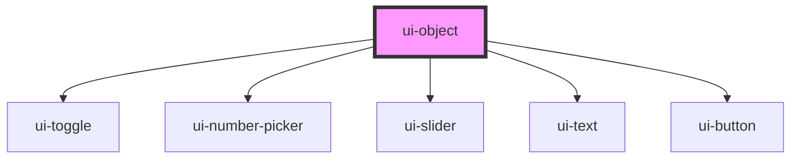

# ui-object

<!-- Auto Generated Below -->

## Overview

Auto-generates an editor for a TD object-type property and persists the full
object on Save. Designed to behave like other UI components with consistent
status and last-updated indicators, while sub-fields operate in local-edit mode.

Usage: Map boolean/number/integer/string fields to child inputs (ui-toggle,
ui-slider, ui-number-picker, ui-text). Child fields do not perform device writes;
only the parent Save writes the entire object, avoiding partial updates.

## Properties

| Property          | Attribute           | Description                              | Type                                    | Default      |
| ----------------- | ------------------- | ---------------------------------------- | --------------------------------------- | ------------ |
| `color`           | `color`             |                                          | `"neutral" \| "primary" \| "secondary"` | `'primary'`  |
| `dark`            | `dark`              | Enable dark mode theme styling when true | `boolean`                               | `false`      |
| `disabled`        | `disabled`          |                                          | `boolean`                               | `false`      |
| `label`           | `label`             | Optional label shown above the editor    | `string`                                | `undefined`  |
| `readonly`        | `readonly`          |                                          | `boolean`                               | `false`      |
| `showLastUpdated` | `show-last-updated` |                                          | `boolean`                               | `false`      |
| `showStatus`      | `show-status`       |                                          | `boolean`                               | `true`       |
| `variant`         | `variant`           | Visual style for the editor container    | `"filled" \| "outlined"`                | `'outlined'` |

## Methods

### `getValue(includeMetadata?: boolean) => Promise<any | { value: any; lastUpdated?: number; status: string; error?: string; }>`

Get current server value or metadata, mirroring other components.

#### Parameters

| Name              | Type      | Description |
| ----------------- | --------- | ----------- |
| `includeMetadata` | `boolean` |             |

#### Returns

Type: `Promise<any>`

### `save() => Promise<boolean>`

#### Returns

Type: `Promise<boolean>`

### `setValue(value: any, options?: { writeOperation?: (value: any) => Promise<any>; readOperation?: () => Promise<any>; optimistic?: boolean; _isRevert?: boolean; }) => Promise<boolean>`

Set the object value (from connector) and optionally bind device write op.

#### Parameters

| Name      | Type                                                                                                                                | Description |
| --------- | ----------------------------------------------------------------------------------------------------------------------------------- | ----------- |
| `value`   | `any`                                                                                                                               |             |
| `options` | `{ writeOperation?: (value: any) => Promise<any>; readOperation?: () => Promise<any>; optimistic?: boolean; _isRevert?: boolean; }` |             |

#### Returns

Type: `Promise<boolean>`

### `setValueSilent(value: any) => Promise<void>`

Silent update from connector (observe/poll) without event emission.

#### Parameters

| Name    | Type  | Description |
| ------- | ----- | ----------- |
| `value` | `any` |             |

#### Returns

Type: `Promise<void>`

## Dependencies

### Depends on

- [ui-toggle](../ui-toggle)
- [ui-number-picker](../ui-number-picker)
- [ui-slider](../ui-slider)
- [ui-text](../ui-text)
- [ui-button](../ui-button)

### Graph

----------------------------------------------

*Built with [StencilJS](https://stenciljs.com/)*
