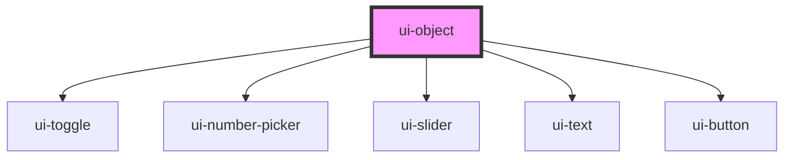

# ui-object

<!-- Auto Generated Below -->

## Overview

A versatile object component designed for WoT device to handle object type TD properties.

It auto-generates an editor interface for TD object-type properties with save button to push
all the changes at once.
It also features status indicators, last updated timestamps.

## Properties

| Property          | Attribute           | Description                                                                                                                                | Type                                    | Default      |
| ----------------- | ------------------- | ------------------------------------------------------------------------------------------------------------------------------------------ | --------------------------------------- | ------------ |
| `color`           | `color`             | Color theme for the active state matching to thingsweb theme                                                                               | `"neutral" \| "primary" \| "secondary"` | `'primary'`  |
| `dark`            | `dark`              | Enable dark mode theme styling when true                                                                                                   | `boolean`                               | `false`      |
| `disabled`        | `disabled`          | Disable user interaction when true                                                                                                         | `boolean`                               | `false`      |
| `label`           | `label`             | Text label displayed above the object editor (optional)                                                                                    | `string`                                | `undefined`  |
| `readonly`        | `readonly`          | Read only mode, display value but prevent changes when true. Just to monitor changes                                                       | `boolean`                               | `false`      |
| `showLastUpdated` | `show-last-updated` | Show last updated timestamp below the component                                                                                            | `boolean`                               | `false`      |
| `showStatus`      | `show-status`       | Show visual operation status indicators (loading, success, failed) right to the component                                                  | `boolean`                               | `true`       |
| `variant`         | `variant`           | Visual style variant of the object editor. - outlined: Border around container (default) - filled: Background-filled container with border | `"filled" \| "outlined"`                | `'outlined'` |

## Methods

### `getValue(includeMetadata?: boolean) => Promise<any | { value: any; lastUpdated?: number; status: string; error?: string; }>`

Gets the current object value with optional metadata.

#### Parameters

| Name              | Type      | Description                                                  |
| ----------------- | --------- | ------------------------------------------------------------ |
| `includeMetadata` | `boolean` | - Whether to include status, timestamp and other information |

#### Returns

Type: `Promise<any>`

Current value or detailed metadata object

### `save() => Promise<boolean>`

Executes the stored write operation to save the complete object to the device.

Combines all field changes into a single object and sends it via the configured
write operation. Handles type coercion and error states automatically.

#### Returns

Type: `Promise<boolean>`

Promise resolving to true if successful, false if failed

### `setValue(value: any, options?: { writeOperation?: (value: any) => Promise<any>; readOperation?: () => Promise<any>; optimistic?: boolean; _isRevert?: boolean; }) => Promise<boolean>`

Sets the object value with optional device communication api and other options.

This is the primary method for connecting object editors to real devices.
It supports optimistic updates, error handling, and stores write operations for Save button.

#### Parameters

| Name      | Type                                                                                                                                | Description                                                    |
| --------- | ----------------------------------------------------------------------------------------------------------------------------------- | -------------------------------------------------------------- |
| `value`   | `any`                                                                                                                               | - The object value to set                                      |
| `options` | `{ writeOperation?: (value: any) => Promise<any>; readOperation?: () => Promise<any>; optimistic?: boolean; _isRevert?: boolean; }` | - Optional configuration for device communication and behavior |

#### Returns

Type: `Promise<boolean>`

Promise resolving to true if successful, false if failed

### `setValueSilent(value: any) => Promise<void>`

This method updates the value silently without triggering events.

Use this for external data synchronization to prevent event loops.
Perfect for WebSocket updates or polling from remote devices.

#### Parameters

| Name    | Type  | Description                        |
| ------- | ----- | ---------------------------------- |
| `value` | `any` | - The object value to set silently |

#### Returns

Type: `Promise<void>`

## Dependencies

### Depends on

- [ui-toggle](../ui-toggle)
- [ui-number-picker](../ui-number-picker)
- [ui-slider](../ui-slider)
- [ui-text](../ui-text)
- [ui-button](../ui-button)

### Graph

----------------------------------------------

*Built with [StencilJS](https://stenciljs.com/)*
