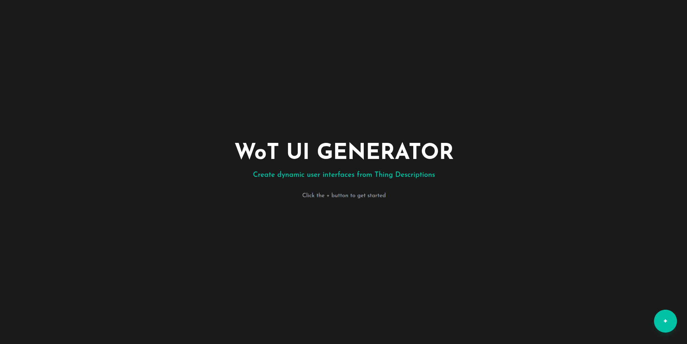
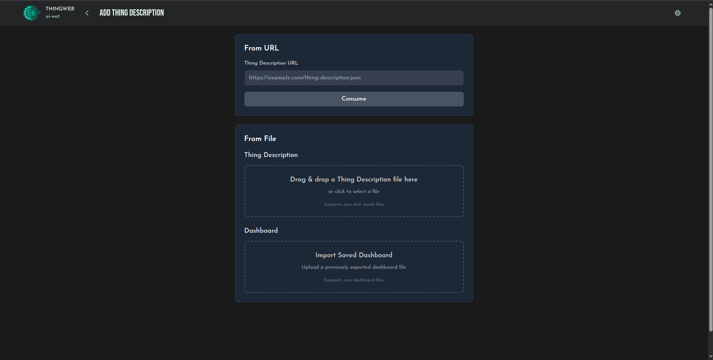
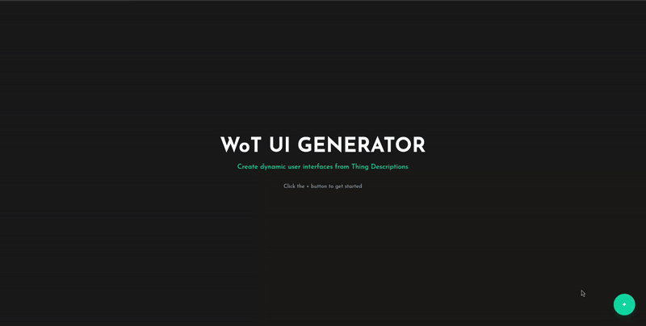
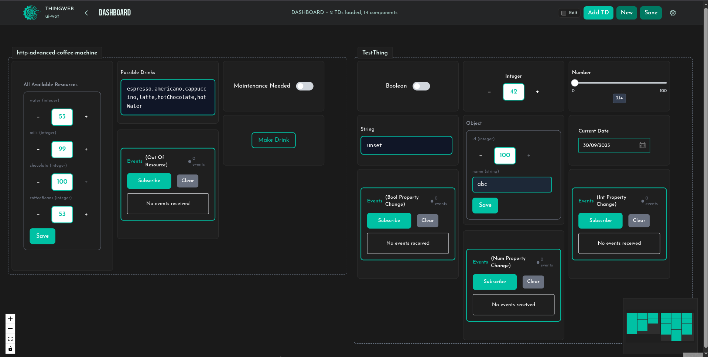
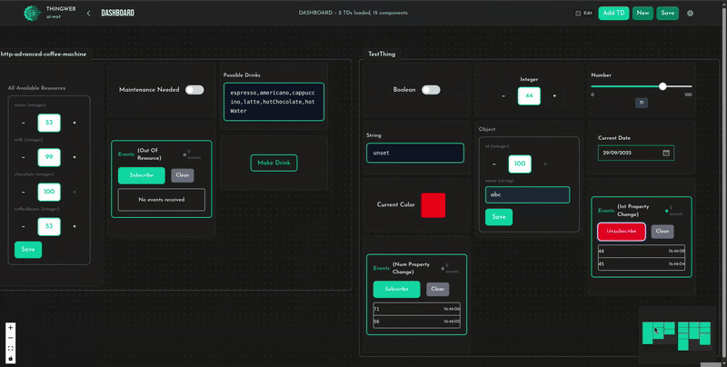
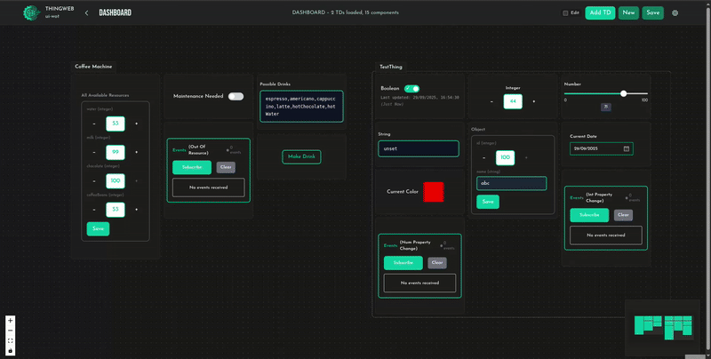
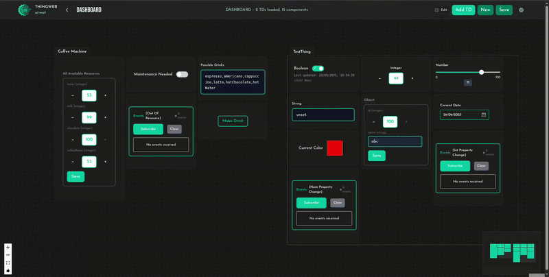

<h1>
  <picture>
  <source media="(prefers-color-scheme: dark)" srcset="https://raw.githubusercontent.com/eclipse-thingweb/thingweb/master/brand/logos/ui-wot_for_dark_bg.svg">
  <source media="(prefers-color-scheme: light)" srcset="https://raw.githubusercontent.com/eclipse-thingweb/thingweb/master/brand/logos/ui-wot.svg">
  
</picture>
</h1>

> A visual dashboard builder that turns WoT Thing Descriptions into interactive web interfaces. Drag, drop, and configure components to create custom dashboards for your IoT devices.

## What is UI-WoT Generator?

The UI-WoT Generator is a React-based web application that automatically creates interactive dashboards from Web of Things (WoT) Thing Descriptions (TDs). It is not limited to only this - it connects the components to the TD and makes them interactive instantly. It supports multiple TDs at once with local TD JSON file support too. Users have full control and can customize everything according to their needs. From arrangement on a canvas (drag, drop, resize) to appearance and behavior (theme, color, properties etc.), everything is customizable.

**Key capabilities:**

- Parse Thing Descriptions from URLs or files
- Generate UI components for properties, actions, and events
- Visual drag-and-drop dashboard editor
- Real-time device connections via node-wot browser bundle
- Customizable themes and styling
- Save and load dashboard configurations

### Table of Contents

- [Prerequisites](#prerequisites)
- [Installation & Setup](#installation--setup)
- [Quick Start](#quick-start)
  - [Loading Thing Descriptions](#loading-thing-descriptions)
  - [Editing and Customizing](#editing-and-customizing)
  - [Strategy Feature](#strategy-feature)
  - [Sections](#sections)
  - [More Features](#more-features)
  - [Multi-Device Dashboards](#multi-device-dashboards)
  - [Save & Load Dashboards](#save--load-dashboards)
- [Tips and Best Practices](#tips-and-best-practices)

## Prerequisites

- [Node.js](https://nodejs.org/) version 20+
- [npm](https://www.npmjs.com/) version 9+
- Modern web browser with ES2015+ support

## Installation & Setup

Since the generator depends on the UI-WoT components library, you need to build both the packages:

1. **Clone the repository:**

   ```bash
   git clone https://github.com/eclipse-thingweb/ui-wot.git
   cd ui-wot
   ```

2. **Install root dependencies:**

   ```bash
   npm install
   ```

3. **Build the components library first:**

   ```bash
   cd packages/components
   npm install
   npm run build
   cd ..
   ```

4. **Set up the generator:**

   ```bash
   cd generator
   npm install
   ```

5. **Start the generator:**

   ```bash
   npm run dev
   ```

6. **Open your browser:**
   Navigate to `http://localhost:5173`

The generator will be running and ready to create dashboards!

## Quick Start

Here's how to create your first dashboard in under a minute:

1. **Start the application** (follow installation steps above)

2. **Navigate to TD input:**

   - At the home page, click '+' to get started
   - You will now be at the 'Add Thing Description' page

   

3. **Load a Thing Description:**

   The generator supports three ways to load Thing Descriptions:

   

   **Option 1: URL Input**

   Perfect for devices already running on your network:

   1. Enter the full URL (e.g., `http://192.168.1.100:8080/counter`)
   2. Click "Consume"
   3. Wait for redirect to affordance page

   

   **Option 2: File Upload**

   For local Thing Description files:

   Run this command in root folder before running the generator

   ```bash
   npm run start:td-host
   ```

   1. In 'From File' section, either click on the 'Thing Description' box or drag a JSON file into the drop zone
   2. If clicked choose the desired file.
   3. The TD will be parsed automatically

   **Option 3: Loading Dashboard from Saved JSON**

   1. In the 'From File' section, either click on the 'Dashboard' box or drag a JSON file into the drop zone
   2. If clicked, choose the desired file
   3. Dashboard will be loaded according to the saved file

4. **Select which affrodances to include:**
   - Select the affordances you want to load in the dashboard
   - If you want to change the component for the affordance, use the dropdown to choose from available options
   - Click "Load" to load the selected affordances and create a dashboard

And there is your fully functional dashboard!



## Editing and Customizing

**Entering Edit Mode:**
To customize the dashboard, tick the edit checkbox at the top right corner of Navbar. The look will change and many icons will appear - now you can design your dashboard layout and customize component behavior:



### Canvas Layout

**Moving Components:**

- **Drag components** anywhere on the canvas
- **Snap to grid** automatically aligns components
- **Collision detection** prevents overlapping

**Resizing Components:**

- **Drag corner handles** to resize width and height
- **Minimum sizes** prevent components from becoming too small
- **Aspect ratios** are maintained for certain component types

### Component Customization

**Accessing Component Settings:**  
Click on the pencil icon on the top right corner of any card to access the edit popup.

In the edit popup, you can access and change all the properties of the components such as:

- **Label** - Display name shown to users
- **Variant** - Choose between the various variants of the component
- **Color theme** - Primary, secondary, accent, neutral
- **Show status** - Display connection status indicator
- **Show timestamp** - Display last updated time etc.
- **Hide card wrapper** - Will hide the rectangular card wrapping around the components

**Removing Components:**  
Clicking on the cross icon will remove the component from the dashboard.

## Strategy Feature

The **Strategy** is one of the most important settings for components - it gives you the option to choose how the components will update. You can choose the strategy from the edit popup menu when customizing any component.

**Available Strategies:**

**Disabled (Default):**

- Component shows initial value only
- User must manually refresh to see updates
- Good for: Configuration values that rarely change

**Observe (Real-time):**

- Device pushes updates immediately when values change
- Most efficient and responsive
- Requires device support (not all devices support this)
- Good for: Rapidly changing sensors, live controls

**Poll (Regular Check):**

- Generator requests new value every few seconds
- Reliable but uses more network bandwidth
- Configure interval: 1-60 seconds (default: 3 seconds)
- Good for: Values that change occasionally

**Auto (Smart):**

- Tries to use observe first
- Falls back to polling if observe isn't supported
- **Recommended for most use cases**

## Sections

**Managing Sections:**
Sections are organizational containers that help group affordance of a TD together.

**Section Features:**

- **Moving sections** - When you move a section, all cards inside it moves with it
- **Resizing sections** - Sections can be resized to accommodate more or fewer components
- **Renaming sections** - Click the pencil icon to rename any section

**Section Customization:**
Access the section edit popup by clicking the settings icon. Here you can:

- Choose border style(Dashed/Solid) or remove it completely
- Change section background color from dropdown
- Use group actions like hiding all wrappers or showing all wrappers at once

**Removing Sections:**
Clicking on the cross icon will remove the section along with all the linked components inside it.

## Multi-Device Dashboards

**Adding More Things:**
You can combine multiple IoT devices in a single dashboard:

1. **Click "+ Add TD"** in the navbar
2. **Load another TD** using URL or file
3. **Select affordances** from the new device
4. **Components are added** to the existing canvas

New TD affordances will be auto arranged

**Managing Multiple Devices:**
To keep track of components from different devices:

- **Section naming** - Rename sections to identify devices easily
- **Color coding** - Change section colors to help identify components from different devices
- **Strategic placement** - Arrange the sections as you prefer to identify them better

## More Features

**Canvas Context Menu:**
Right-click outside any section/component to access the context menu with additional options:

- **Background display** - Choose to show dots, grids, or none in the background
- **UI visibility** - Option to hide minimap and toolbar for a cleaner workspace
- **Scroll behavior** - You can switch the scroll behavior to either zoom or pan
- **Reset layout** - Return all components to their default positions

## Save & Load Dashboards

### Saving Your Work

**How to Save:**

1. **Click "Save"** in the navbar
2. **Enter a name** for your dashboard
3. **Choose save location and save** - This downloads a JSON file that you can also share with others



### Loading Saved Dashboards

**Loading Process:**  
To load a previously saved dashboard, Simply use the dashboard JSON file in the 'From File' section to restore your previously saved dashboard configuration.



## Tips and Best Practices

**Getting Started:**

- Begin with simple examples before trying complex devices
- Start with a few components and add more gradually

**Performance:**

- Use "Auto" strategy for most components (it's smart about choosing the best method)
- Avoid polling intervals shorter than 1 second unless necessary
- Monitor the connection status - too many failed requests can slow things down

**Troubleshooting:**

- Check browser console for error messages
- Verify TD URLs are accessible from your browser
- Ensure CORS is properly configured for cross-origin requests
- Use the component status indicators to diagnose connection issues

---

For detailed information about individual components, their properties, and customization options, see the [UI-WoT Components Documentation](../components/README.md).
